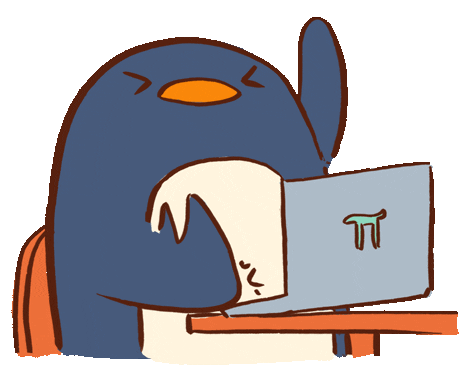

<h1 align="center">Hi, I'm Kim (she/her)</h1>

  

  Hitting that keyboard hard with software, solutions, and documentation.

<b>Let's connect! 🤝</b>

  

<!-- Languages -->

  <b>💻 Languages</b>

  <picture>
    <source media="(prefers-color-scheme: dark)" srcset="https://github-readme-stats.vercel.app/api/top-langs/?username=kimpenguin&theme=dark&layout=compact&count_private=true">
    
  </picture>

  

